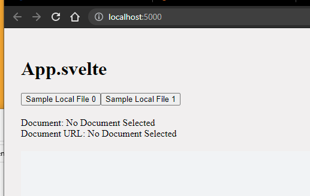
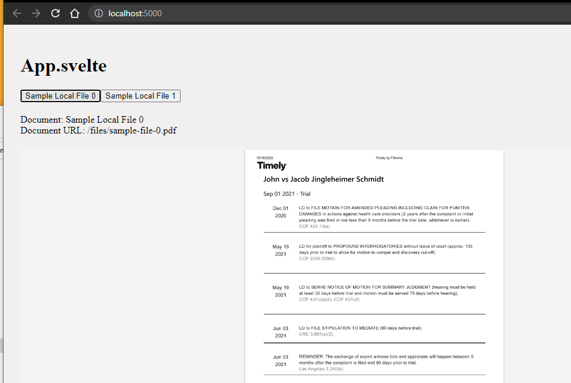

# Svelte PDFTron Doc Previewer

## Prerequisites
Make sure you have the following installed.
- Node v12.22.0
- Yarn 1.22.10

## Setup
1. Clone this repo
```shell
git clone https://github.com/joshtune/fv-doc-previewer.git
```
2. Run `yarn` in the root of the project to install dependencies

## Add Licence File
In project root directory create a file named `env.ts` with your license key in it like
```typescript
export const LICENSE_KEY = 'LICENSE_KEY_HERE';
```

## Run Project
1. Open your task manager and focus on CPU.  For the sake of screenshots below I use a windows machine.
2. Run `yarn build` to build project
3. Run `yarn dev` to run project
4. Go to http://localhost:5000/



5. Click on `Sample Local File 0` or `Sample Local File 1` and you should see document load

