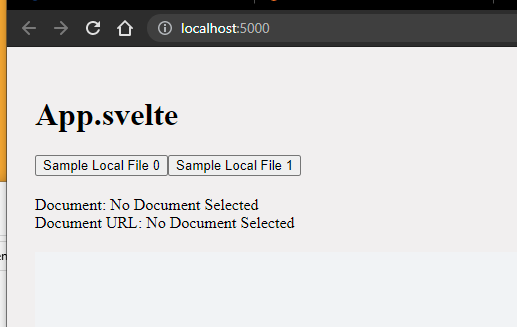
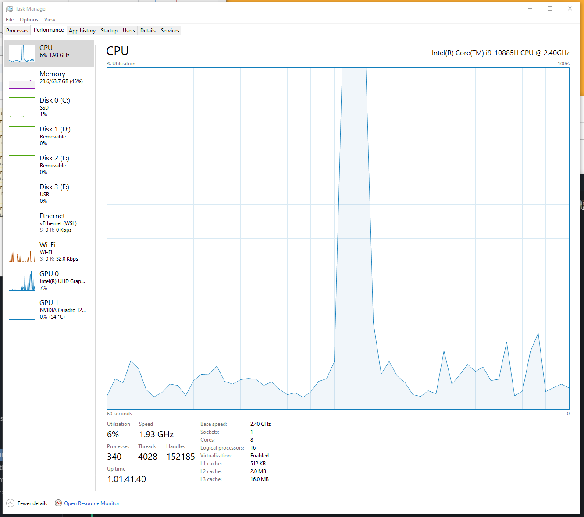
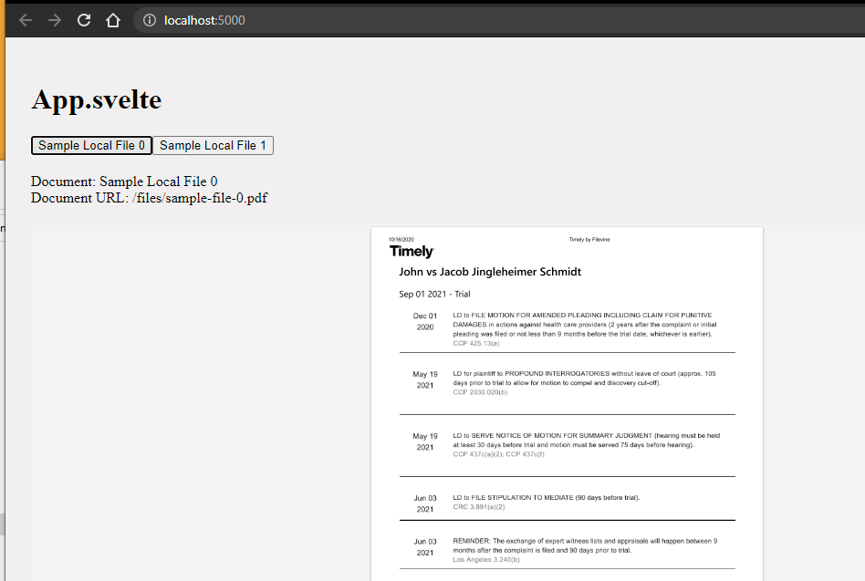

#Svelte PDFTron Doc Previewer

Here is the sample requested.


## Setup
1. Clone this repo
2. In project root create `env.ts` with your license key in it
```typescript
export const LICENSE_KEY = 'LICENSE_KEY_HERE';
```
3. Run `yarn` in the root of the project
4. Run `yarn build` to build project

## Run Project
1. Run `yarn dev` to run project
2. Before you go to http://localhost:5000/.  Make sure you have your task manager open



Here you should notice a spike in CPU



3. Click on `Sample Local File 0` or `Sample Local File 1` and you should notice the CPU spike is less dramatic



NOTE: My computer is not ideal for real life scenarios since it is a high performance machine for development.

## Code Explained
All code is in file `./src/App.svelte`.

On app initial load `onMount` is called and will load `WebViewer`.  Everytime you select a file `afterUpdate` will be called and trigger 
```typescript
webViewerInstance?.loadDocument(documentItem.downloadLink, {
    filename: documentItem.fileName,
});
```
